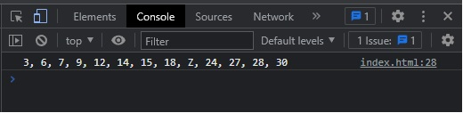

# Coding Test FE Finplan

## Informasi Pembuat
- Kalam Mahardhika
- akunkerjakalam@gmail.com
- https://www.linkedin.com/in/kalammd/

## Cara Menjalankan Nomor 1 - 5 
- Buka file index.html untuk setiap nomornya
- klik kanan pada browsernya
- lalu pilih inspeksi
- maka akan terbuka tab baru dan pilih console

## Cara Menjalankan Test FE
- Buku folder frontend-test
- Buka terminal pada folder tersebut
- Ketikan perintah npm install
- Jika sudah, ketikan perintah npm run dev
- Maka akan muncul link yang bisa di klik untuk menjalakankan aplikasi
- Semua fitur sudah berjalan
- Crop photo otomatis dicrop dan dikompres gambarnya

## Preview Code Nomor 1
```
function bilanganCacah(N) {
let numbers = [];

  for (let i = 1; numbers.length < N; i++) {
    if (i % 3 === 0 && i % 7 === 0) {
      numbers.push("Z");
    } else if (i % 3 === 0 || i % 7 === 0) {
      numbers.push(i);
    }
  }

  return numbers;
}

let N = 13;
let output = bilanganCacah(N);
console.log(output.join(", "));
```
> Outputnya
```
3, 6, 7, 9, 12, 14, 15, 18, Z, 24, 27, 28, 30
```

## Preview Code Nomor 2
```
function searchWord(text) {
  const animals = ["sang gajah", "serigala", "harimau"];
  const results = [];

  text = text.toLowerCase();

  animals.forEach(function(animal) {
    let startIndex = text.indexOf(animal);

    while (startIndex !== -1) {
      results.push(animal);
      startIndex = text.indexOf(animal, startIndex + 1);
    }
  });

  return results.join(" - ");
}

const text = "Berikut adalah kisah sang gajah. Sang gajah memiliki teman serigala bernama DoeSang. Gajah sering dibela oleh serigala ketika harimau mendekati gajah.";
const results = searchWord(text);

console.log(results);
```
> Outputnya
```
sang gajah - sang gajah - serigala - harimau
```

## Preview Code Nomor 3
```
function checkPassword(password) {
  if (password.length < 8 || password.length > 32) {
    return "Kata sandi minimal 8 karakter dan maksimal 32 karakter";
  }

  if (/^\d/.test(password)) {
    return "Karakter awal tidak boleh angka";
  }

  if (!/\d/.test(password)) {
    return "Harus memiliki angka";
  }

  if (!/[A-Z]/.test(password) || !/[a-z]/.test(password)) {
    return "Harus memiliki huruf kapital dan huruf kecil";
  }

  return "Kata sandi valid";
}

console.log(checkPassword("5andiwara")); // Karakter awal tidak boleh angka
console.log(checkPassword("sandiwar4")); // Harus memiliki huruf kapital dan huruf kecil
console.log(checkPassword("Sandiwar4")); // Kata sandi valid
```
> Outputnya
```
Karakter awal tidak boleh angka
Harus memiliki huruf kapital dan huruf kecil
Kata sandi valid
```

## Preview Code Nomor 4
```
function cacahTerkecil(arr) {
  arr.sort((a, b) => a - b);

  let id = arr[0];
  for (let i = 0; i < arr.length; i++) {
    if (arr[i] !== id) {
      return id;
    }
    id++;
  }
}

console.log(cacahTerkecil([5, 2, 8, 4, 3, 10]));
console.log(cacahTerkecil([2, 3, 4, 6])); 
console.log(cacahTerkecil([8, 6, 7, 12])); 
```
> Outputnya
```
6
5
9
```

## Preview Code Nomor 5
```
function pola(n) {
  if (n % 2 === 0) {
    return "Harus bilangan ganjil";
  }

  let result = "";
  for (let i = 0; i < n; i++) {
    let text = "";
    for (let j = 0; j < n; j++) {
      if (i > 0 && i < n - 1 && j > 0 && j < n - 1) {
        if (Math.abs(n - 1 - i) > j || Math.abs(n - 1 - i) < j) {
          text += "O ";
        } else {
          text += "X ";
        }
      } else {
        text += "X ";
      }
    }
    result += text + "\n";
  }
  return result;
}

console.log(pola(5));
console.log(pola(3));
console.log(pola(7));
console.log(pola(2));
```
> Outputnya
```
 X X X X X
 X O O X X
 X O X O X
 X X O O X
 X X X X X

 X X X
 X X X
 X X X

 X X X X X X X
 X O O O O X X
 X O O O X O X
 X O O X O O X
 X O X O O O X
 X X O O O O X
 X X X X X X X

 Harus bilangan ganjil
```

## Screenshots Nomor 1 - 5



## Screenshots FE Test


